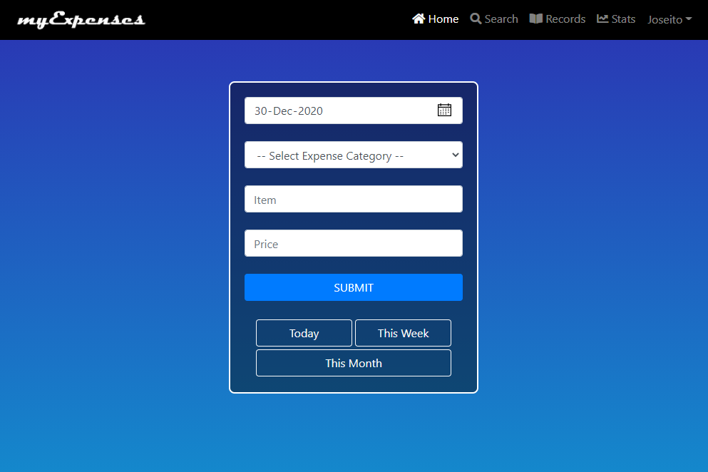

<p align="center">
    

  <h2 align="center">myExpenses</h2>

  <p align="center">
    myExpenses an expense tracker build with ReactJS and Firebase.
    <br />
    Developed By: <strong>Joseito Fernandes</strong>
    <br />
    <br />
    <a href="https://myexpenses2.web.app/">View Demo</a>
    ·
    <a href="https://github.com/joseito-terence/myexpenses/issues">Report Bug</a>
    ·
    <a href="https://github.com/joseito-terence/myexpenses/issues">Request Feature</a>
  </p>
</p>
<br>

## About The Project



myExpenses is an easy to use expense tracking web app. 
It was originally built using PHP and MySQL in the year 2018 during my first year at college and is hosted at [myexpenses.epizy.com](https://myexpenses.epizy.com). And later in 2020 decided to shift the code base to ReactJS.


### Built With

Following are the major frameworks and libraries used to build this project.
* [ReactJS](https://reactjs.org/)
* [Firebase](https://firebase.google.com/)
* [Bootstrap](https://getbootstrap.com)

## Getting Started

To get a local copy up and running follow these simple example steps.

### Installation

1. Clone the repo
   ```sh
   git clone https://github.com/joseito-terence/myexpenses.git
   ```
2. Install NPM packages
   ```sh
   npm install
   ```
3. Start NPM server.
   ```sh
   npm start
   ```


